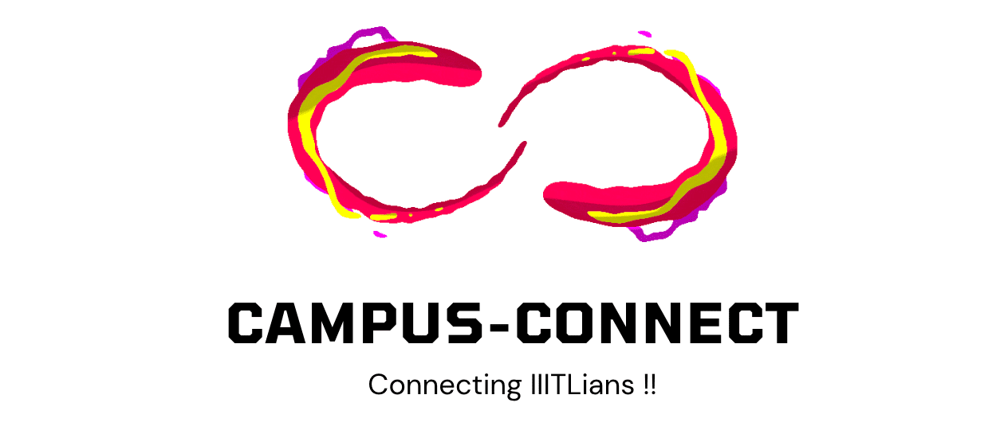
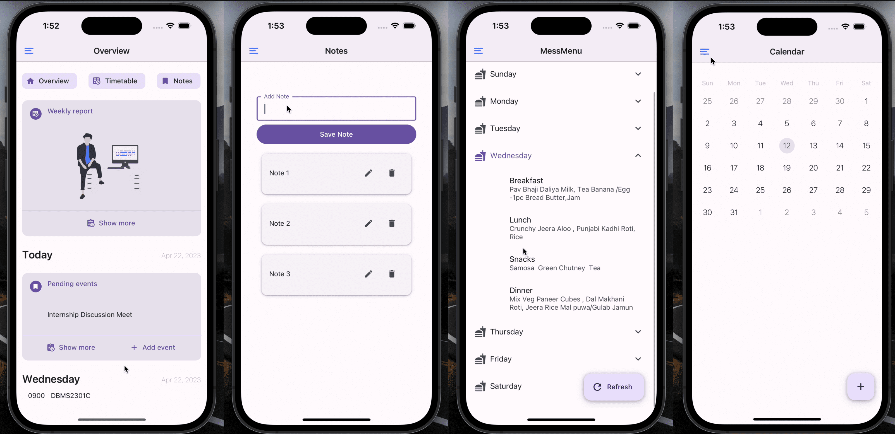
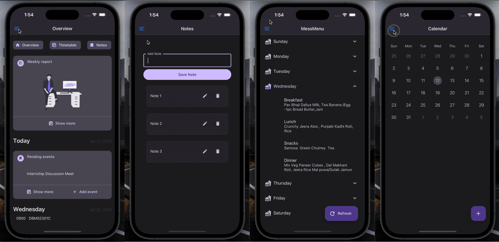
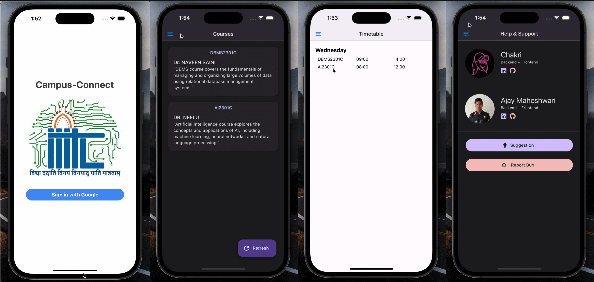
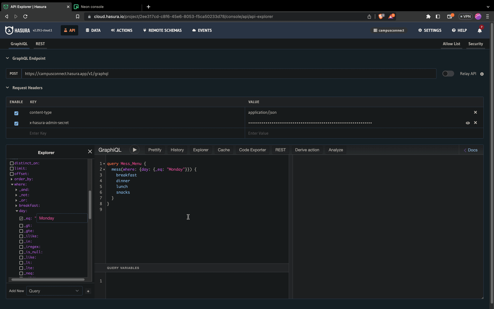

**Campus-Connect** is a project designed to connect students with their college department and provide them with necessary information and features to enhance their college experience.

**Note :** This repository is a code base for demonstration of the Campus-Connect project. The original repository for Campus-Connect is private due to security reasons.

## Features

- **Mess Menu**: View daily & weekly menu details for the college mess.
- **Course Enrollment** : Access information about the courses students are currently enrolled in.
- **Note Taking**: Take and manage notes for various subjects or topics.
- **Calendar**: View and manage college events, important dates, and schedule.
- **Overview Screen** : To overview everything at once 
- **Easy Google sign-in**: Students can easily sign in to their Campus-Connect account using their Google credentials.
- **Dark mode**: The app supports a dark mode interface, allowing users to switch to a darker color scheme for improved readability in low-light environments.

## Demo Video & Screenshots 

For Video Please Click on this [link]([https://github.com/user/repo/blob/branch/other_file.md](https://drive.google.com/file/d/1FhpE5Q3l8LPVoTQu4AN4qzMtLHo8IK8w/view?usp=sharing))

#### Light Mode

#### Dark Mode

#### Others

#### Neon Console

#### Hasura Console

#### Schema

## Developers

- **Ajay Maheshwari** ([@AjayMaheshwari23](https://github.com/AjayMaheshwari23))
- **Chakradhar Reddy Devireddy** ([@chakri68](https://github.com/chakri68))

## Technologies used 

